# Interpretable Chest X-Ray Pneumonia Detection

**Transfer Learning · Medical Computer Vision · Grad-CAM and Eigen-CAM Explainability**

[](https://www.python.org/downloads/)
[](https://pytorch.org/)
[](LICENSE)

End-to-end deep learning project for classifying chest X-rays as **Normal** or **Pneumonia** using a ResNet50 transfer-learning model. The project emphasizes not only classification performance, but also interpretability through side-by-side **Grad-CAM** and **Eigen-CAM** heatmaps.

> **Disclaimer:** This project is for research and education only. It is not validated, approved, or intended for clinical diagnosis.

---

## Project Highlights

| Area | Implementation |
|------|----------------|
| **Task** | Binary chest X-ray classification: Normal vs Pneumonia |
| **Backbone** | ResNet50 with ImageNet transfer learning |
| **Imbalance Handling** | Weighted sampler and weighted cross-entropy |
| **Evaluation** | Accuracy, Precision, Recall, F1, PR-AUC, ROC-AUC |
| **Explainability** | Grad-CAM and Eigen-CAM overlays on model predictions |
| **Artifacts** | Saved checkpoint, metrics JSON, curves, CAM comparisons, failure cases |

Pneumonia screening is a high-recall medical imaging task: missed pneumonia cases are more concerning than false alarms. For that reason, this project reports class-specific metrics and Precision-Recall behavior rather than relying on accuracy alone.

---

## Results

Evaluation was run on the official Kaggle test split using the best saved ResNet50 checkpoint, `models/best_resnet50.pth`.

### Model Performance

| Metric | Value |
|--------|------:|
| Test Accuracy | **90.38%** |
| Weighted Precision | **90.69%** |
| Weighted Recall | **90.38%** |
| Weighted F1-score | **90.20%** |
| Macro Precision | **91.34%** |
| Macro Recall | **88.21%** |
| Macro F1-score | **89.38%** |
| ROC-AUC | **96.51%** |
| PR-AUC | **97.54%** |

### Class-Level Performance

| Class | Precision | Recall | F1-score | Support |
|-------|----------:|-------:|---------:|--------:|
| Normal | **93.94%** | **79.49%** | **86.11%** | 234 |
| Pneumonia | **88.73%** | **96.92%** | **92.65%** | 390 |

### Confusion Matrix

| Actual \ Predicted | Normal | Pneumonia |
|--------------------|-------:|----------:|
| Normal | 186 | 48 |
| Pneumonia | 12 | 378 |

The model correctly identifies most pneumonia cases, achieving **96.92% recall** on the Pneumonia class. The main tradeoff is a higher false-positive rate on Normal images, with 48 Normal X-rays flagged as Pneumonia.

---

## Evaluation Figures

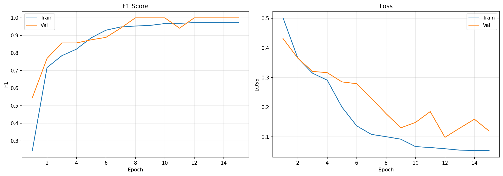


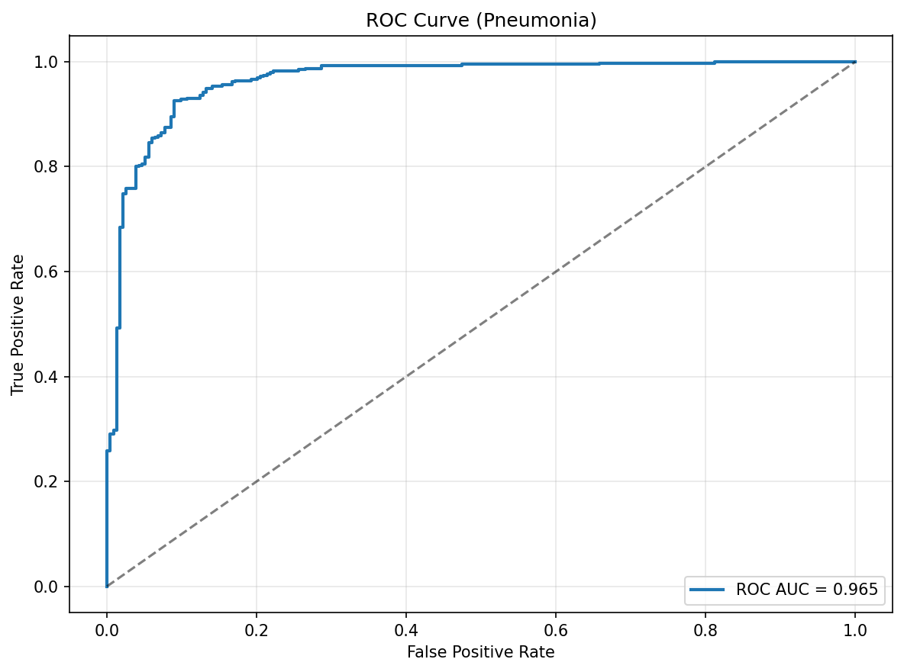

---

## Explainability

Each CAM comparison contains three panels:

```text
Original X-ray | Grad-CAM overlay | Eigen-CAM overlay
```

Grad-CAM highlights class-discriminative regions using gradients, while Eigen-CAM projects the final convolutional activations onto their dominant component. Showing both helps check whether the model focuses on plausible lung regions instead of irrelevant borders, labels, or image artifacts.

### Correct Prediction Heatmaps

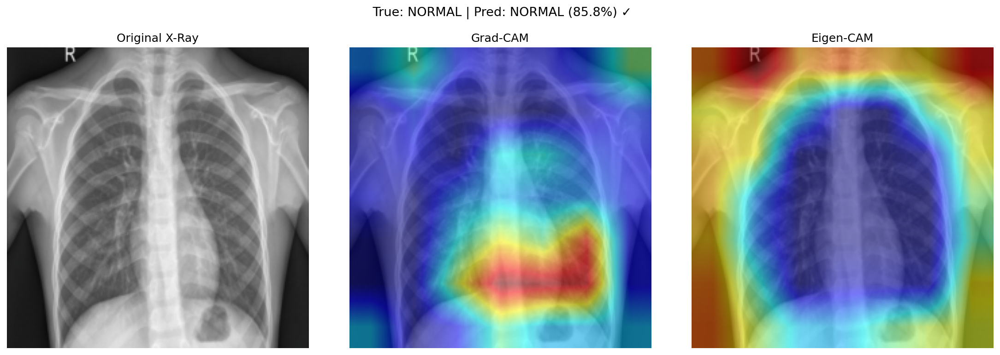

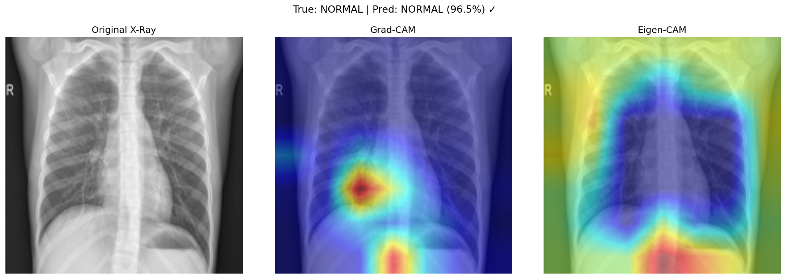

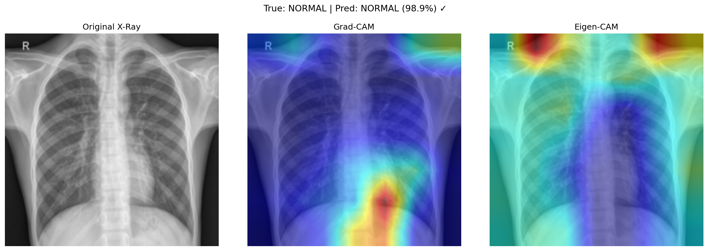

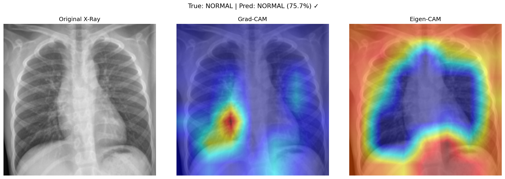

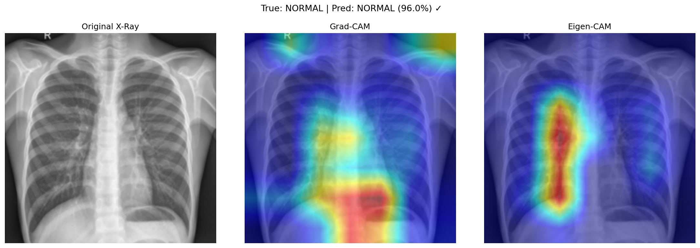

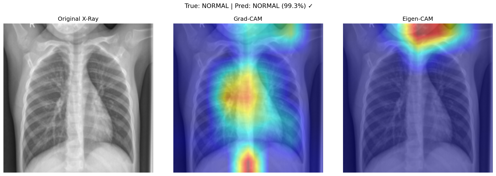

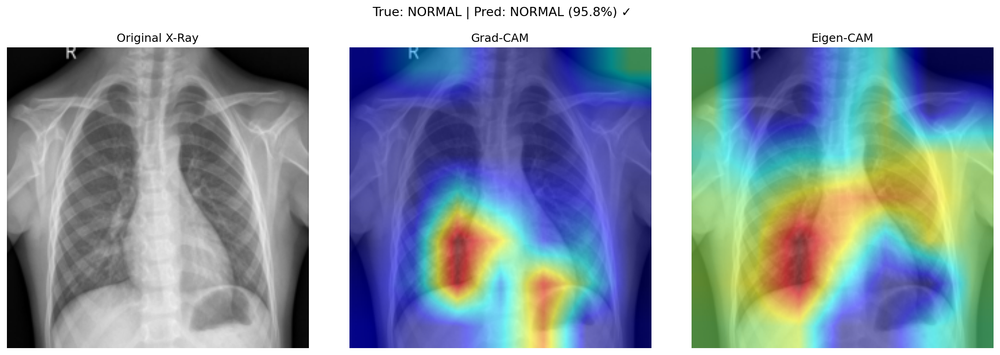

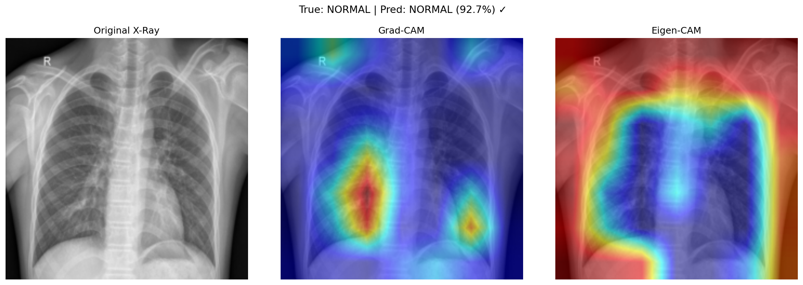

---

## Failure Case Analysis

Failure cases are the most important examples to inspect in medical AI because they reveal where the model is likely to be unreliable.

### False Negatives: Pneumonia Missed as Normal

False negatives are clinically important because they represent pneumonia cases the model failed to flag. These examples may involve subtle opacities, mild disease presentation, overlapping anatomy, or image characteristics that make consolidation harder to distinguish.

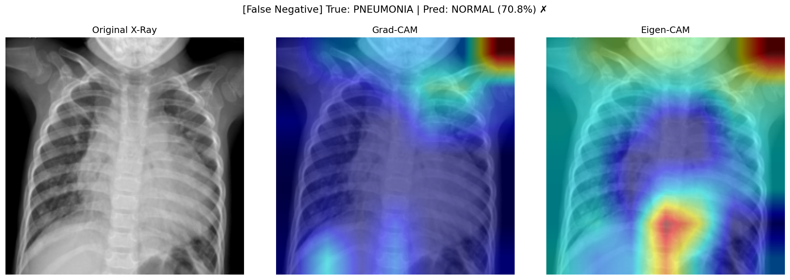

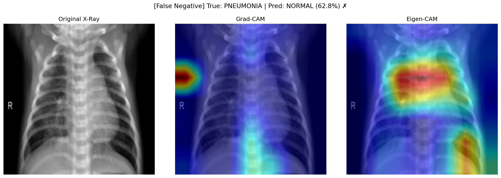

### False Positives: Normal Misclassified as Pneumonia

False positives are less dangerous than false negatives in a screening context, but they can increase unnecessary follow-up. These examples may be caused by normal anatomical variation, contrast differences, positioning, or image artifacts that resemble disease-related opacity.

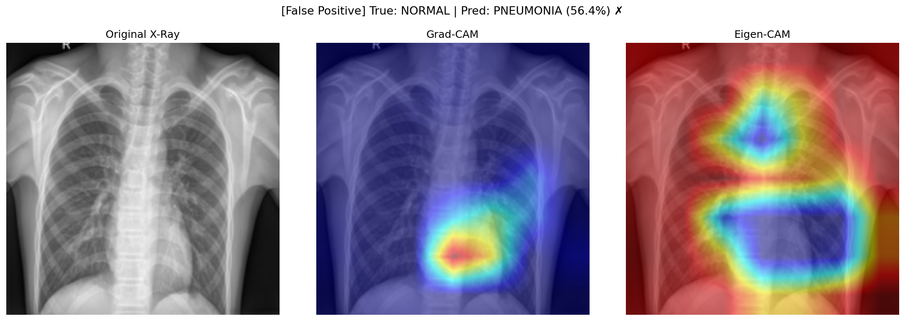

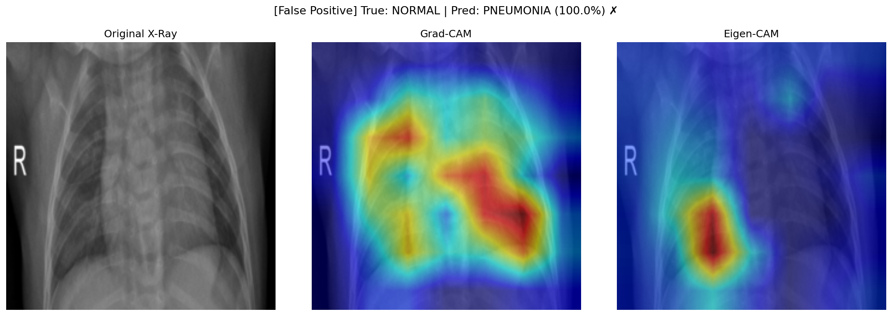

### Failure Summary

- **False negatives:** 12 Pneumonia images were predicted as Normal.
- **False positives:** 48 Normal images were predicted as Pneumonia.
- The model prioritizes Pneumonia sensitivity, which is appropriate for a screening-style objective, but the false positive rate should be reduced before any real-world deployment.
- CAM explanations are useful for auditing model behavior, but they do not prove clinical correctness.

---

## Methodology

### Dataset

This project uses the Kaggle Chest X-Ray Pneumonia dataset, based on pediatric chest radiographs from Guangzhou Women and Children's Medical Center.

Expected dataset layout:

```text
data/raw/chest_xray/
├── train/
│   ├── NORMAL/
│   └── PNEUMONIA/
├── val/
│   ├── NORMAL/
│   └── PNEUMONIA/
└── test/
    ├── NORMAL/
    └── PNEUMONIA/
```

### Preprocessing

- Convert grayscale X-rays to 3-channel RGB
- Resize images to `224 x 224`
- Apply ImageNet normalization for transfer learning
- Apply training-only augmentation: horizontal flip, small rotation, brightness/contrast jitter

### Model

ResNet50 was selected because it provides strong transfer-learning performance, stable training behavior, and a clear final convolutional block for CAM visualization.

Training strategy:

1. Train classifier head with the backbone frozen.
2. Fine-tune later ResNet layers after initial convergence.
3. Save the best checkpoint by validation F1-score.

### Class Imbalance

The dataset is imbalanced toward Pneumonia. The training pipeline uses:

- Weighted random sampling to expose the model to more Normal cases.
- Weighted cross-entropy to penalize minority-class mistakes.
- PR-AUC and F1-score to evaluate beyond accuracy.

---

## Quick Start

### 1. Clone and install

```bash
git clone https://github.com/bachnguyennn/Chest_X-Pneumonia-Detection.git
cd Chest_X-Pneumonia-Detection

python -m venv .venv
source .venv/bin/activate
pip install -r requirements.txt
```

### 2. Pull the saved checkpoint with Git LFS

```bash
git lfs install
git lfs pull
```

### 3. Download the dataset

```bash
pip install kaggle
python scripts/download_dataset.py
```

### 4. Evaluate the saved model

```bash
python -m src.evaluate --checkpoint models/best_resnet50.pth --data-root data/raw/chest_xray
```

### 5. Open the final report notebook

```bash
jupyter notebook notebook/chest_xray_report.ipynb
```

---

## Project Structure

```text
Chest_X-Pneumonia-Detection/
├── data/
│   ├── raw/                  # Kaggle dataset, not committed
│   └── processed/
├── models/
│   ├── best_resnet50.pth     # Saved checkpoint, tracked with Git LFS
│   └── history_resnet50.json
├── notebook/
│   └── chest_xray_report.ipynb
├── reports/
│   └── figures/              # Curves, confusion matrix, CAMs, failure cases
├── scripts/
│   └── download_dataset.py
├── src/
│   ├── cam.py                # Grad-CAM and Eigen-CAM
│   ├── dataset.py            # Dataset, transforms, weighted sampler
│   ├── evaluate.py           # Metrics and report figures
│   ├── model.py              # ResNet50 and EfficientNet-B0 builders
│   └── train.py              # Training loop
├── demo_app.py
├── requirements.txt
└── README.md
```

---

## Limitations

1. **Dataset bias:** The dataset is pediatric and comes from a limited clinical setting.
2. **Binary labels:** Pneumonia is not separated into bacterial, viral, or other subtypes.
3. **No external validation:** Results are from the Kaggle test split only.
4. **Calibration not performed:** Softmax confidence should not be interpreted as clinical probability.
5. **Explainability is approximate:** CAMs show model attention, not causal medical evidence.
6. **Not clinical software:** This is not a regulated medical device.

---

## Tech Stack

- Python 3.10+
- PyTorch and torchvision
- scikit-learn
- pytorch-grad-cam
- matplotlib and seaborn
- Jupyter
- Gradio demo

---

## License

MIT License. See [LICENSE](LICENSE).

Dataset: [Kaggle Chest X-Ray Pneumonia](https://www.kaggle.com/datasets/paultimothymooney/chest-xray-pneumonia). Review Kaggle terms before use.

---

## Citation

If you use this project academically, cite the original dataset:

> Kermany, Daniel S., et al. "Identifying Medical Diagnoses and Treatable Diseases by Image-Based Deep Learning." *Cell*, 2018.
